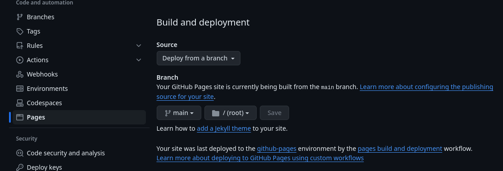
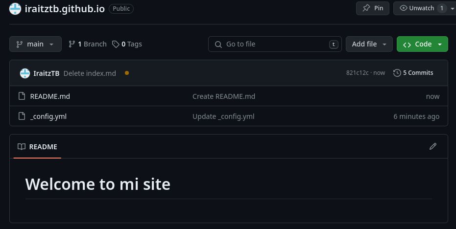
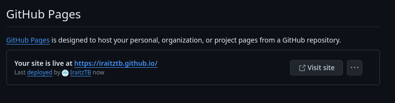

# Github como hosting

GitHub y git son una combinación ganadora en lo que respecta a la automatización en las empresas. Cada cambio realizado queda registrado y podemos gestionar qué hacer en cada caso de manera automática, pudiendo así gestionar:

* Cambios en la infrastructura (GitOps)
* Cambios en el código (DevOps)
* Cambios en los modelos de datos (DataOps)
* Cambios en los modelos de machine learning (MLOps)
* etc...

Nosotros nos iniciaremos con algo más sencillo, albergar nuestra web personal de cara a ofrecer un curriculum online para nuestros empleadores.

## Github Pages

[Github Pages](https://pages.github.com/) nos permite albergar una página web para posibles proyectos, páginas personales o blogs, completamente libre de coste.

Algunos ejemplos:
* https://github.com/cristinafsanz/github-pages Ejemplo de creación de web en github pages que explica como crear webs con github pages
* https://workwithcarolyn.com/blog/digital-cv-guide Ejemplo de cómo crear un CV usando Github Pages (https://carolstran.github.io/cv/)

Podemos albergar código _estáticos_ (HTML, CSS y JavaScript) que será mostrado por Github Pages, o podemos emplear _frameworks_ que nos permitan convertir nuestro código Markdown a código estático.

Una de las soluciones que nos ofrece es usar el framework [Jekyll](https://jekyllrb.com/)


_Veamos si podemos seguir los pasos que nos indican en https://workwithcarolyn.com/blog/digital-cv-guide para crear nuestro CV_

Hay algunas consideraciones que quizás no estén bien explicadas...

Deberemos seleccionar el despliegue por ramas



Deberán existir dos ficheros en nuestro repositorio



Donde el fichero _ _config.yml_ deberá contener el tema de Jekyll indicado

```yaml
theme: jekyll-theme-minimal
title: 💻✒️📄🌟
description: Carolyn Stransky's CV
```

Una vez hechos los cambios, podremos visitar nuestra web personalizada



Podéis tomar como guía para el contenido del README de la propia autora: https://github.com/carolstran/cv

Pero podéis buscar el que más os guste aquí: https://pages.github.com/themes/

Tenéis más información en la guía oficial https://docs.github.com/es/pages