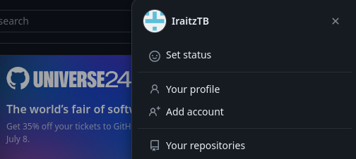
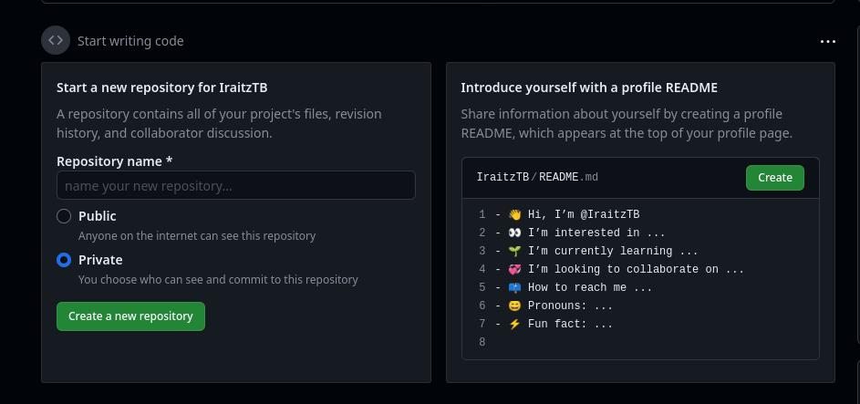
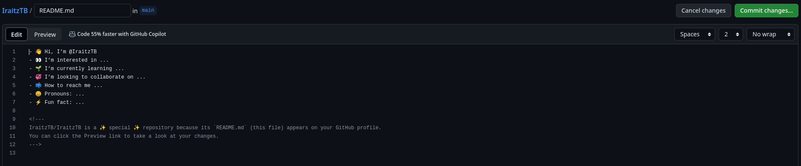
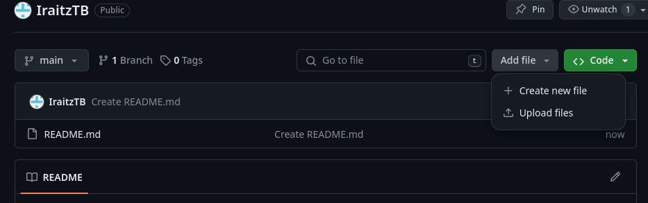
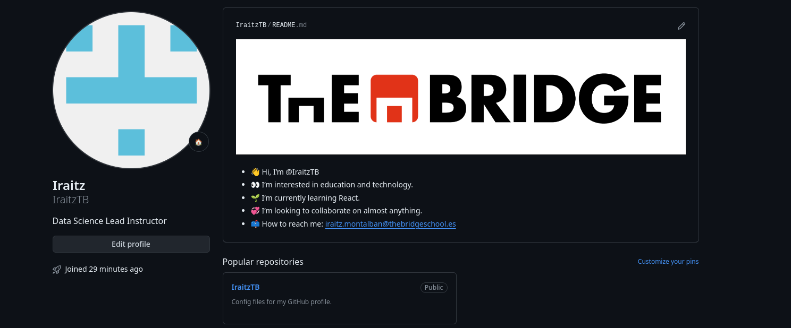
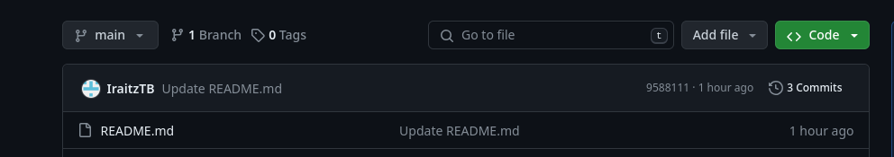
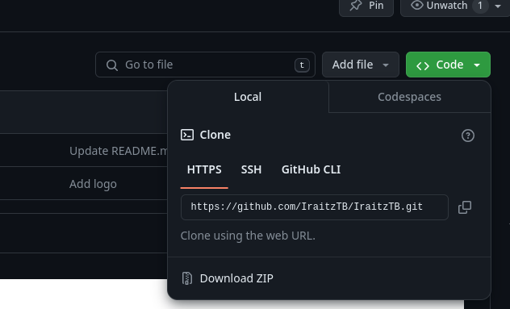
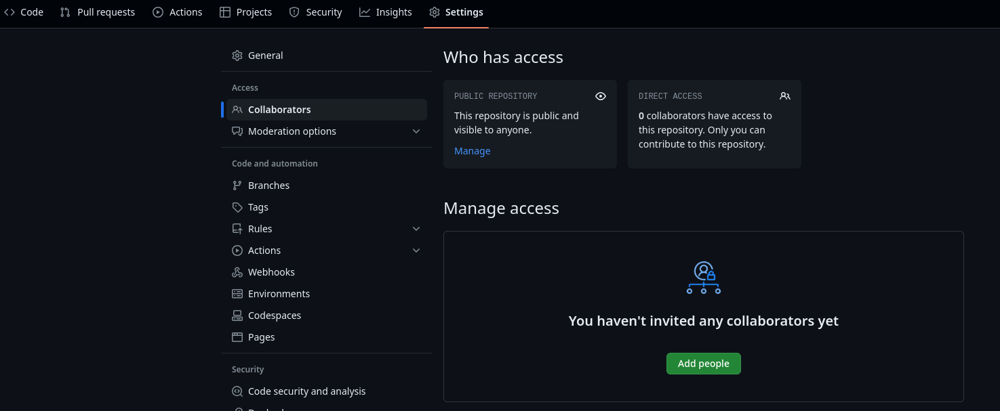
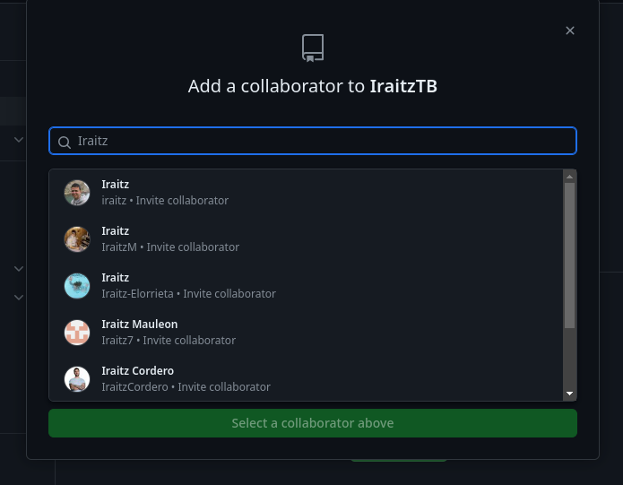

# Github

GitHub es un servicio de alojamiento en la nube para repositorios de Git. 

https://github.com/

Permite a los desarrolladores almacenar repositorios de Git de manera remota y ofrece muchas características que facilitan la colaboración en proyectos de código abierto y privados. GitHub proporciona una interfaz de usuario basada en web, así como integración con la línea de comandos de Git.

Es habitual que las empresas manejen repositorios de código de cara a fomentar la colaboración pero también poder tener un control de toda la actividad de desarrollo en procesos de auditoria, por ejemplo.

Veremos que en el mundo del desarrollo es muy habitual contar con un perfil público en Github que nos permita exponer nuestros proyectos, qué sabemos hacer e interactuar con otros desarrolladores.

Aquí os dejamos algunos ejemplos:
* [Brais Moure](https://github.com/mouredev)
* [Miguel Ángel Durán](https://github.com/midudev)
* [Abhishel Thakur](https://github.com/abhishekkrthakur)
* [Sebastián Ramírez](https://github.com/tiangolo)

Hasta el momento solo hemos visto dos tipos de interacción:

* `git clone` que realiza una copia de trabajo del repositorio
* `git pull` para traernos cambios que hayan podido ser añadidos por otros al repositorio.

Poco a poco iremos familiarizándonos con git y todos sus comandos. Y no hay mejor manera de hacerlo que creando nuestros primeros repositorios en Github.

## Cuenta Github

Deberéis dirigiros a la web de github (https://github.com/) e indicar que queréis crear una cuenta.

Podéis introducir vuestro email en la página inicial 

Y rellenar la información necesaria

Aseguraros de elegir el plan free

Hecho! Ya disponéis de un perfil de Github :tada:

## Perfil Github

Ahora añadiremos algo de información sobre nosotros para hacerlos más interesante.

En la esquina derecha podéis hacer click en el icono y os enseñará el menú donde podremos indicar que queremos acceder a nuestro perfil.

Aquí podréis cambiar vuestro avatar, indicar desde donde trabajáis, en qué empresa o cualquier información que creáis relevante para vuestros potenciales empleadores o seguidores.

Github es esencialmente un servicio en el que crear repositorios con vuestros códigos. Pero existe un repositorio especial que se visualizará como parte de vuestro perfil. En él podéis elaborar algo más vuestra marca personal introduciendo enlaces a otros perfiles profesionales (LinkedIn por ejemplo), perfiles de desarrollador (Kaggle por ejemplo) o web personal.

En la home de github veréis que os propone crear este repositorio

La ventaja es que puede realizarse mediante código markdown con lo que podremos emplear lo aprendido hasta ahora. Cuando hayáis acabado de editar vuestro perfil, podréis emplear otro de los comandos de git `git commit` para indicar los cambios realizados.

Dado que se trata de un repositorio, podemos añadir contenido en base a lo que queremos mostrar.

Dado que sabemos cómo referenciar fotos en nuestros markdown ¿seríais capaces de incluir una imagen en vuestro perfil? Eso lo hará mucho más visual.

_Cread vuestro perfil en Github incluyendo una imagen._

Enhorabuena, no solo habéis creado vuestro perfil si no que habéis creado vuestro primer repositorio y realizado cambios sobre este.

Podéis revisar los cambios realizados revisando los commits en el repositorio.

## Repositorios

Los repositorios son la estructura base donde organizaremos nuestro trabajo. Podremos crear tantos como queramos o necesitemos aunque dado que Github aboga por el código abierto, si elegimos que nuestro respositorio sea privado, tendremos algunas restricciones con respecto a los públicos (a no ser que paguemos una suscripción superior).

Podéis crear repositorios específicos para gestionar por ejemplo los ejercicios que realicéis en clase, de cara a tener una copia de vuestros ejercicios.

Nos pedirá cierta información a rellenar

Algunas indicaciones:
* README es un fichero base con el que podemos iniciar nuestro repositorio para que se inicie con cierto contenido (en nuestro caso es recomendable seleccionarlo)
* .gitignore es un fichero especial que le indica a git que ignore ficheros que puedan ser muy voluminosos y no sean necesarios para el correcto funcionamiento del código
* La licencia es la modalidad en que nuestro código podrá ser usado por terceros. Para conocer mejor este mundo https://opensource.org/license

Y una vez creado podremos iniciar nuestro trabajo clonando el repositorio a una carpeta en nuestra máquina para poder añadir contenido.

Dos acciones que no hemos visto hasta ahora es el añadir contenido al área de stagging, hacer un commit y enviar al respositorio remoto nuestros cambios.

* `git add ...` añade los cambios locales para ser registrados como un cambio a incluir en el repositorio
* `git commit ...` agrupa todos los cambios añadidos bajo un mismo mensaje representando el objetivo de dichos cambios en el código
* `git push...` envía los commits registrados en nuestra máquina al repositorio local.

VSCode nos permite hacer una gestión visual de estos tres pasos en la pestaña de Git del menu.

Una vez añadidos a nuestra área de stagging podremos hacer el commit y enviar los cambios al repositorio remote.

_Clonad vuestro repositorio, modificad el README y añadid vuestros cambios_

## Trabajo en equipo

Organizarnos así tiene sentido sobre todo cuando colaboramos con compañeros. Podemos en cualquier repositorio incluir colaboradores de nuestro trabajo. Compañeros que nos ayudarán a ir más rápido en lo que sea queramos conseguir con nuestro trabajo.

En el repositorio donde queramos trabajar en colaboración podremos ir a la sección settings y añadir a las personas en base a su nombre de usuario en Github.

_Clonad el repositorio de algún compañero, modificad el README o añadid un fichero y añadid vuestros cambios. El propietario podrá ver los cambios en los commits del repositorio_
