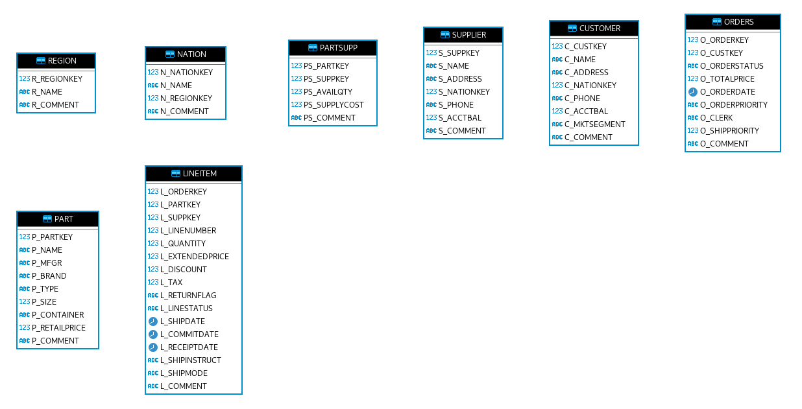

# Modelado con Snowflake

Para este ejercicio os vamos a pedir que extraigáis ciertos indicadores de la base de datos Snowflake que creamos previamente. El resultado será un cuadro de mando que indique cómo de bien (o mal) está yendo nuestro negocio.

## El modelo de datos

Emplearemos la base de datos Snowflake que creamos en sesiones anteriores.

Si os conectáis con DBeaver o PowerBI a la base de datos **SNOWFLAKE_SAMPLE_DATA**.**TPCH_S1000** veréis que se os muestran las tablas tal que así.

No hay conexión entre las tablas porque al tratarse de una base de datos de carácter analítico (procesado masivo) no dispone de restricciones del tipo Clave Primaria y Clave Foránea. No suelen ser necesarias aunque nos ayudan a entender cómo enlazar las tablas. Habrá que tirar de intuición.

También podemos usar de referencia la [documentación oficial](https://docs.snowflake.com/en/user-guide/sample-data-tpch).

Tened en cuenta que esta versión (TPCH_S1000) cuenta con billones de filas en su totalidad con lo que no será posible traérnoslo a nuestro entorno (habrá que usar las capacidades de SQL o Direct Query de los sistemas).

## La tarea

Os pedimos crear un cuadro de mando donde se muestren los desempeños de distintos empleados, clientes y productos de nuestro conjunto de datos.

Disponéis de multitud de indicadores que podéis crear, pero quizás lo importante es poder analizarlo en distintos periodos (filtrando por años o meses).

Un aspecto relevante es poder segregar por naciones, regiones, estado de los pedidos, prioridades de los pedidos, ...

Nuestra recomendación es que prestéis atención a las métricas y agregaciones que necesitaréis:

* Número de ordenes: COUNT(OrderID)
* Rendimiento de las ventas: SUM(precioUnidad*UnidadesVendidas)
* Tiempos de entrega: ReceiptDate - ShippingDate

Y añadáis la información relativa a las dimensiones:

* Por cliente: CustomerID
* Por producto: ProductID
* Por region: RegionID
* Por prioridad: Ship priority

Y vemos que enlaces (JOINs) habrá que realizar entre las tablas.

## Los entregables

Podéis elegir la plataforma que queráis para realizar el cuadro de mando. Lo importante es que mostréis un cuadro de mando visual, empleando campos de texto e imagen para que sea un resultado visual. No os cortéis con dar contexto e introducir información sobre qué habéis asumido en vuestro análisis. No hacen falta muchas agregaciones/visualizaciones, solo algunas clave para mostrar datos _curiosos_ que hayáis visto.

Os recomendamos que uséis PowerBI dado que es lo que más hemos visto y más os encontraréis en el ámbito laboral.
