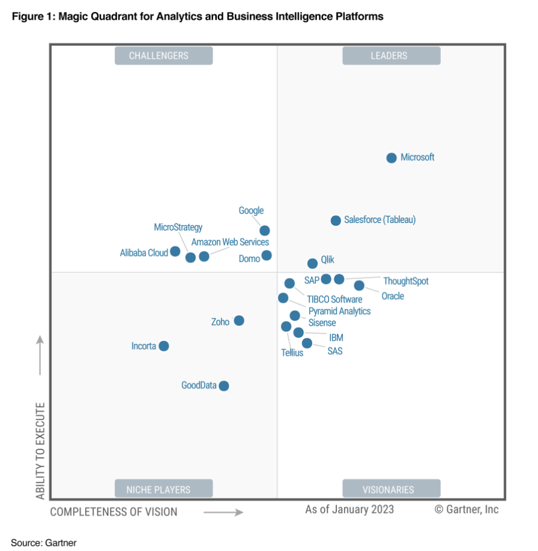
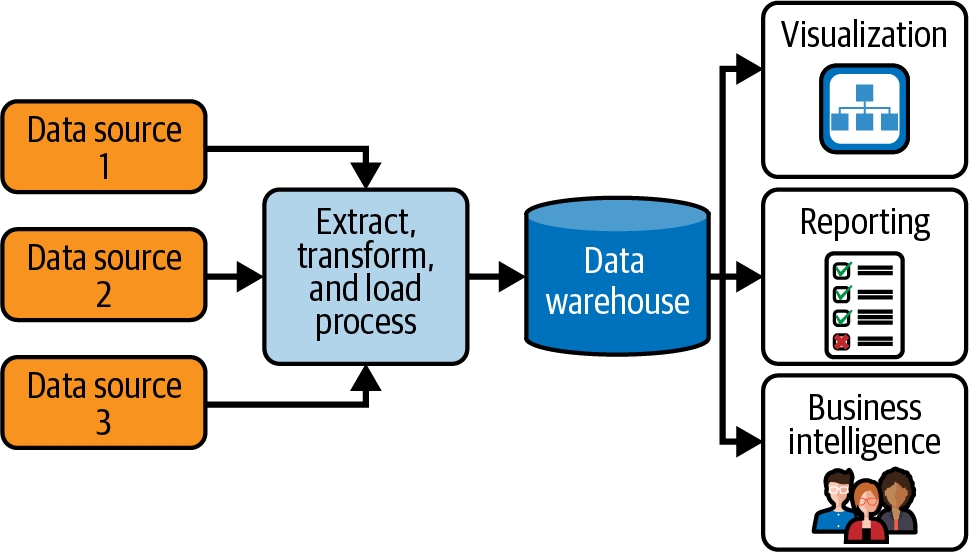
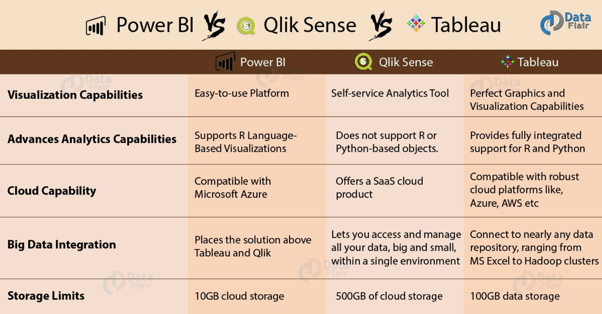
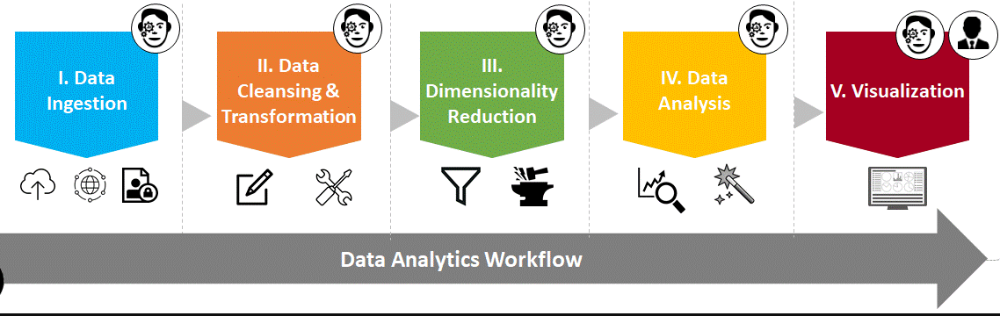

# Business Intelligence 📊

## Contenido

1. Introducción Business Intelligence
2. Principales Herramientas BI
3. Storytelling, el arte de contar historias a través de los datos.
4. Ejemplo Dashboard Tableau

## Contexto

> *Vivimos en un mundo complejo en constante crecimiento.*
> 

- **Toma de decisiones en tiempo real**
    
    
    - **First to Market Strategy (PMV)**
        
        
        
        
        Lo ideal es salir (pivotar) el primero en un segmento del mercado. Esto permite ganar ventaja frente a la competencia que se genere en el momento que te copien tu producto/servicio y puedan lanzarlo al mercado (ej. iPhone).
        
    
    - **Ventaja Competitiva**
        
        Según **Porter** (el padre del marketing), la **ventaja** **competitiva** consiste en tomar acciones ofensivas o defensivas para competir, con éxito, en el mercado generando un retorno sobre la inversión.
        
        **Tipos:**
        
        1. Coste
        2. Diferenciación 
        3. Nicho o especialización 
        
        
        

## Business Intelligence

- **Definición**
    
    El **Business Intelligence (BI)** se refiere a un conjunto de estrategias, tecnologías, procesos y herramientas que permiten a las organizaciones transformar datos en información significativa para la **toma de decisiones empresariales**. El BI se enfoca en recopilar, analizar y presentar datos de manera eficaz, con el fin de proporcionar información valiosa que respalde la toma de decisiones informadas.

    

    Imagen de [Dechiphering Data Architectures](https://learning.oreilly.com/library/view/deciphering-data-architectures/9781098150754/)

- **Key Performance Indicators**

    Muchos negocios se rigen por métricas que establecen el nivel de progreso, impacto, madurez operativa, etc. de las áreas de negocio relevantes. Ejemplos de estos indicadores son:

    **KPIs Generales de Negocio**

    - **Tasa de conversión**: Porcentaje de visitantes que se convierten en compradores.
    - **Valor promedio de la venta**: Promedio del valor de cada venta.
    - **Número de ventas**: Número total de ventas realizadas.
    - **Tasa de reembolso**: Porcentaje de ventas que se reembolsan.
    - **Costo de adquisición de clientes**: Costo promedio de adquirir un nuevo cliente.
    - **Tasa de retención de clientes**: Porcentaje de clientes que se mantienen en el negocio.

    **KPIs de Marketing**

    - **Tasa de engagement**: Porcentaje de usuarios que interactúan con el contenido publicado.
    - **Nivel de satisfacción del cliente**: Calificación promedio de la satisfacción del cliente.
    - **Tasa de creación de contenido**: Número de artículos, videos, etc. publicados en un período determinado.
    - **Tasa de participación en redes sociales**: Número de personas que interactúan con el contenido en redes sociales.
    - **Tasa de crecimiento de la audiencia**: Crecimiento del número de seguidores o visitantes en un período determinado.

    **KPIs de Operaciones**

    - **Tiempo de respuesta a los clientes**: Tiempo promedio que tarda el equipo de atención al cliente en responder a las consultas.
    - **Tasa de resolución de problemas**: Porcentaje de problemas resueltos en un período determinado.
    - **Nivel de satisfacción del personal**: Calificación promedio de la satisfacción del personal.
    - **Tasa de eficiencia de procesos**: Eficiencia promedio de los procesos internos.
    - **Tasa de reducción de costos**: Reducción promedio de costos en un período determinado.

    **KPIs de Finanzas**

    - **Ingresos**: Número total de ingresos del negocio.
    - **Costos**: Número total de costos del negocio.
    - **Beneficio neto**: Diferencia entre los ingresos y los costos.
    - **Tasa de rentabilidad**: Porcentaje de beneficio neto sobre los ingresos.
    - **Deuda**: Nivel de deuda del negocio.
    - **Tasa de rotación de inventario**: Número de veces que se vende el inventario en un período determinado.
    
- **Herramientas**
Disponemos de herramientas pensadas para interactuar con los sistemas de almacenamiento de datos (Data Warehouse) que hablan su idioma (SQL) y nos permiten extraer información agregada de **enormes cantidades de datos** de cara a traducirlos en esos indicadores (KPIs) para su supervisión por la plana ejecutiva o actores encargados del seguimiento.

    
    
    - **Microsoft Power BI**
        
        
        - **Power BI Desktop**: aplicación de escritorio (solo Windows) para transformar, visualizar datos y crear informes de los mismos.
        - **Power BI Service**: servicio online que permite publicar informes y configurar la actualización automática para la toma de decisiones.
        - **Power BI Mobile**: aplicación móvil compatible con iOS y Android para tener acceso a la visualización de informes, no edición.
        
        **Rutas de aprendizaje y certificación**:
        
        [Microsoft Certified: Power BI Data Analyst Associate - Learn](https://docs.microsoft.com/es-es/learn/certifications/power-bi-data-analyst-associate/?tab=tab-learning-paths)
        
        Puedes consultar toda la documentación gratuita de Power BI [aquí](https://docs.microsoft.com/es-es/power-bi/guidance/)
        
    - **Qlik**
        
        
        - **QlikView (básica)**
        - **Qlik Sense (profesional completa)**
        - **Qlik Sense Mobile**
        
        
        
        [Formación gratuita en analítica y alfabetización de datos | Qlik](https://www.qlik.com/es-es/services/training/free-training)
        
    - **Google Data Studio**
        
        
        Herramienta online totalmente gratuita (hasta 1 GB) de Google para transformar los datos en informes y paneles de visualización fáciles de consultar y compartir.
        
        [Google Data Studio Overview](https://datastudio.google.com/)
        
        La versión Profesional de Google es **[Looker](https://connect.looker.com/)**.
        
    - **Tableau**
        
        [Comience su prueba gratuita de Tableau](https://www.tableau.com/es-es/products/trial)

Más herramientas: https://www.moderndatastack.xyz/companies/business-intelligence-bi

## ****Storytelling****

Cómo crear una presentación efectiva, es decir, maximizar nuestra capacidad de impacto e influencia.

**SIN STORYTELLING**

- somos olvidados.
- los datos son difíciles de memorizar.
- quedamos a la merced del detalle.

**¿Qué es una historia y por qué a las personas nos encantan?**

- Crea emoción y empatía.
- Hace que seamos memorables.
- Aumenta el recuerdo de los detalles.
- Evoca la imaginación en la audiencia, conectando con el subconsciente.

**Pilares**

- Mensaje o mensajes (objetivo)
    
    - ¿Qué quieres que **PIENSE** tu audiencia?
    
    - ¿Qué quieres que **SIENTA** tu audiencia?
    
    - ¿Qué quieres que **HAGA** tu audiencia?
    
- Guión (contenido / estructura): comienzo, nudo, desenlace.
    - **Personajes** (protagonistas) que sirven para empatizar con la audiencia.
    - **Método** **LOCK,** 4 fases:
        
        - Lead (protagonista → audiencia)
        
        - Objetive (mensaje) 
        
        - Confrontation (dificultades)
        
        - Knock End (la gran batalla final)
        
    - **Apertura y Cierre**
        
        El hilo conductor con un inicio impactante que conecte con la audiencia y enganche hasta el desenlace.
        
- Escenificación
    
    - Formato.
    
    - Lenguaje sensorial.
    
    - El poder de la voz: entonación, volumen, silencios, etc.
    
    - Interacción con la audiencia.
    
- Ensayo
    
    - Grábate, cronométrate, pide feedback, pule los detalles.

## Ejemplos Dashboard

Las herramientas como Tableau cuentan con multitud de ejemplos públicos que podéis investigar para entender todas las posibilidades que estas os ofrecen.

* https://public.tableau.com/app/discover

Algunas soluciones os dejan jugar con muestras de demo para haceros una idea:

* https://demo.lightdash.com/login

