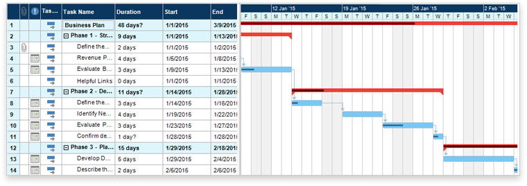
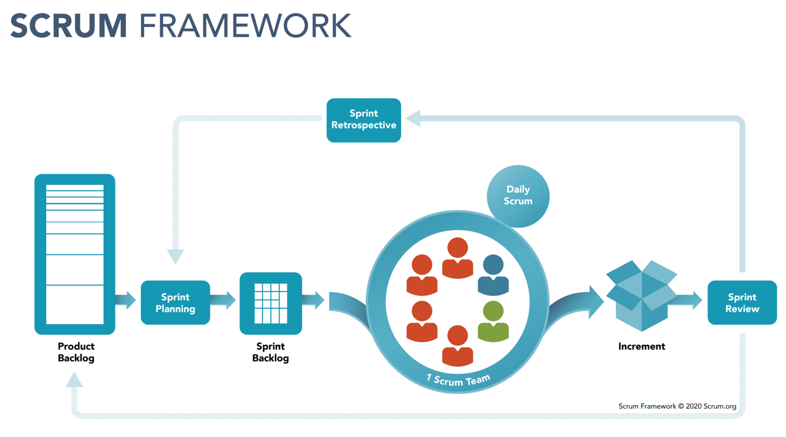
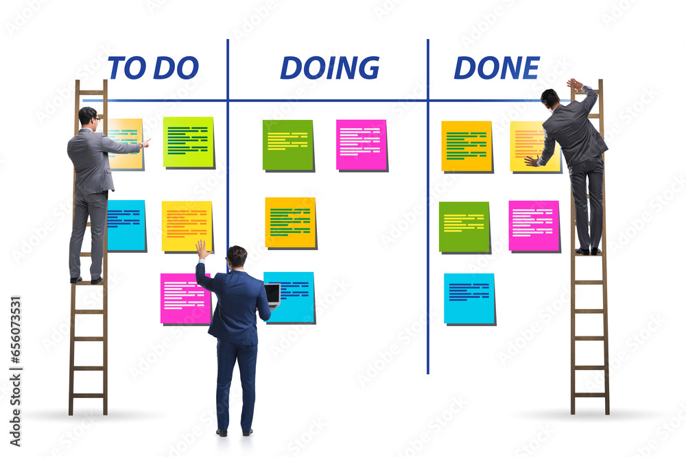
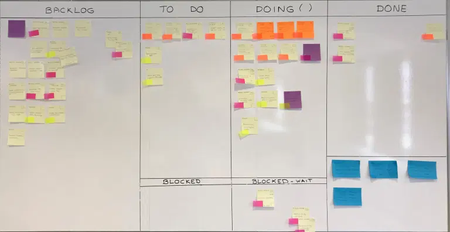

# Taller de metodologías Ágiles 🚀

Veremos qué son las metodologías Ágiles y como pueden impactar a la entrega de nuestros proyectos.

# Contexto

> *Vivimos en un mundo complejo en constante crecimiento.*
> 

Gestionar y organizar proyectos, recursos y plazos es difícil. Más aún en entornos cambiantes. 

- **Gestión y desarrollo de proyectos de forma tradicional**
    - **Metodología Waterfall o Cascada**
        
        Es un método para la gestión de un proyecto de forma lineal donde los requisitos de los stakeholders, especialmente los clientes, se recopilan al inicio del proyecto para luego diseñar un plan secuencial que se adecúe a ellos.
        
        
        
    
    - **Project Management Professional (PMI - PMBoK® Guide)**
        1. Recopilación y Análisis de requisitos.
        2. Planificación del proyecto
        3. Ejecución del proyecto
        4. Monitorización y Control (cambios)
        5. Cierre (análisis de resultados)
    
        Habitualmente encontraremos estos requisitos y seguimiento plasmados en un diagrama [gantt](https://www.gantt.com/)

        

    - **Desventajas**
        - _Imposibilidad_ de cambiar los requisitos una vez se ha iniciado el desarrollo del proyecto sin impacto significativo.
        - Admite cambios en los requisitos de desarrollo del proyecto aunque la planificación inicial ya se haya completado pero estos tienen un impacto en el cronograma y el presupuesto.
        - La fase de pruebas y validación sólo se produce al final del proyecto.
        - Hay recursos del equipo parados ya que no pueden iniciar su parte hasta que el equipo responsable de la fase anterior finalice.

# Alternativas

Quizás uno de los mayores males en el mundo del desarrollo es el cambio de contexto y el no poder cumplir expectativas base de nuestros clientes, priorizando algunas tareas menos relevantes.

[Los efectos del cambio de contexto](https://www.youtube.com/watch?v=Yqi9Gwt-OEA)

Los métodos ágiles favorecen la coordinación y priorización de tareas minimizando impacto en el equipo encargado del desarrollo.

- **Agile**
    - **¿Qué NO es Agile?**
        
        Agile NO es una metodología. Un método es algo rígido y ordenado que se debe seguir de forma sistemática para llegar a un resultado o fin determinado.
        
    
    - **¿Qué es Agile?**
        
        Es un enfoque (marco o entorno) de trabajo que permite a los equipos la capacidad de adaptarse de una forma más rápida y fácil a los cambios o nuevos requisitos que surgen en el desarrollo de un proyecto.
        
    
    - **Manifiesto ágil**
        
        Pese a que hay muchas referencias anteriores, Agile tiene su inicio en 2001 con la creación del Manifiesto Agile (Utah) para el desarrollo de software.  
        
        Actualmente se aplica a proyectos de todo tipo.
        
        **Objetivo**
        
        Una mejor manera de comercializar los productos más rápido, aceptando los cambios en los proyectos sin que estos repercutan significativamente en el coste o retrasen el cronograma.
        
        - **Los 12 principios del Manifiesto Agil**
            
            [Principios del Manifiesto Ágil](https://agilemanifesto.org/iso/es/principles.html)
            

- **Trabajo en equipo**
    - Agile ofrece una formación de equipo dedicada y protegida para el desarrollo del proyecto.
    - Existen roles con responsabilidades concretas a la hora de garantizar el proceso.
    - Dispone de ceremonias pensadas para favorecer la comunicación eficiente.

# Diferenciar conceptos

Dentro del marco de metodologías ágiles encontramos diferentes aproximaciones. Unas más orientadas a crear un producto escalable desde el primer entregable (Scrum) y otras pensadas para disponer de un progreso sostenible en el tiempo (Kanban).

# SCRUM

Aquí disponéis de una guía sobre SCRUM https://scrumguides.org/ pero os daremos algo más de detalle en 

- **Intro a Scrum**
    
    

    Scrum es un marco (framework) ligero que ayuda a las personas, equipos y organizaciones a generar valor a través de soluciones adaptables para problemas complejos.
    
    - Scrum es simple y deliberadamente incompleto, solo define las partes teóricas necesarias.
    - Scrum se basa en la inteligencia colectiva de las personas,  guía sus relaciones e interacciones.
    - Scrum se basa en el empirismo y el pensamiento [Lean](https://www.pragma.co/es/blog/el-pensamiento-lean-como-filosofia-de-vida).

    
    
    - **Objetivos**
        - Entrega, desarrollo y mantenimiento de forma incremental.
        - Gestión del conocimiento y la experiencia del equipo.
        - Mejora continua, transparencia y trabajo en equipo.
        - Tener una definición común a las tareas y complejidad de las mismas.

    
    
    - **Pilares (TIA)**
        - [Transparencia](https://scrumguides.org/scrum-guide.html#transparency) (confianza)
        - [Inspección](https://scrumguides.org/scrum-guide.html#inspection) (autoevaluación)
        - [Adaptación](https://scrumguides.org/scrum-guide.html#adaptation) (flexibilidad)
    
    - **Historias de usuario**

        Las historias de usuario es como definimos el trabajo a acometer. Toda historia de usuario debe de poder descomponerse en subtareas que al finalizar otorgen al usuario la funcionalidad deseada.

        

        Uno de los aspectos más importantes a la hora de definir historias serán las:

        - **Definition of Ready**: Cuando una historia puede acometerse dado que sus requisitos anteriores están satisfechos.
        - **Definition of Done**: Cuando una historia se puede dar por concluida satisfactoriamente.

        Determinar cuanto tiempo puede llevar una tarea es complicado y además casi siempre fallamos. Por ello, las metodologías ágiles abogan por determinar un alcance laxo mediante un ejercicio democrático conocido como el Scrum Poker: https://scrumpoker.online/

        [Referencia](https://www.atlassian.com/es/agile/project-management/user-stories)
    
    - **Equipo**
        - *Stakeholders* son los interesados a los que deberemos mantener informados. Pueden ser nuestros clientes pero también todo actor relevante que deba aprobar el producto finalmente entregado.
        - [Developers](https://scrumguides.org/scrum-guide.html#developers)
        - [Product Owner](https://scrumguides.org/scrum-guide.html#product-owner)
        - [Scrum Master](https://scrumguides.org/scrum-guide.html#scrum-master)

    - **Artefactos**
        - [Product Backlog](https://scrumguides.org/scrum-guide.html#product-backlog) (requerimientos ordenados)
        - [Sprint Backlog](https://scrumguides.org/scrum-guide.html#sprint-backlog) (descomposción / paquetización)
        - [Incremento](https://scrumguides.org/scrum-guide.html#increment) (mejora continua, aporte de valor)
    
    - **Eventos**
        - [The Sprint](https://scrumguides.org/scrum-guide.html#the-sprint) (recomendado 1 mes)
        - [Sprint Planning](https://scrumguides.org/scrum-guide.html#sprint-planning) (máx. 8 horas para Sprint de 1 mes)
        - [Daily Scrum](https://scrumguides.org/scrum-guide.html#daily-scrum) (15 minutos)
        - [Sprint Review](https://scrumguides.org/scrum-guide.html#sprint-review) (máx. 4h para Sprint de 1 mes)
        - [Sprint Retrospective](https://scrumguides.org/scrum-guide.html#sprint-retrospective) (máx. 3h para Sprint de 1 mes)
        
        > *“Lo que pasa en las retros, se queda en las retros”*
        > 

- **Certificaciones**
    - [Scrum.org](http://Scrum.org)
        
        Certificación americana.
        
        La más reconocida internacionalmente. 
        
        80 preguntas en 60 minutos (20 minutos para repaso)
        
        Aprox. 150€ 1 intento. (inglés)
        
        No caduca.
        
        No penalizan las preguntas erróneas.
        
        Algunas preguntas son multiple choice (avisa)
        
    
    - [European Scrum](https://www.europeanscrum.org/inicio.html)
        
        Certificación disponible en Español. 
        
        40 preguntas en 30 minutos (10 minutos para repaso)
        
        150€ 2 intentos. 
        
        Se renueva cada año (25€), demuestra que estás actualizado. 
        
        No penalizan las preguntas erróneas.
        
        Algunas preguntas son multiple choice (no avisa).
        
# KANBAN

Kanban difiere en un enfoque más orientado al mantenimiento y gestión de potenciales incidentes o peticiones puntuales que surgen a lo largo del ciclo de vida de un proyecto.

- **Intro a Kanban**
    
    

    A diferencia de Scrum no tiene unas ceremonias cerradas, dado que debe admitir cambios de foco y alcance. Podemos pedir cuando existen una serie de tareas asociadas a una historia de usuario, mostrar el progreso y así recoger _feedback_ de los interesados.

    Uno de los aspectos más relevantes es limitar el Work In Progress (WIP). El equipo de desarrollo solo puede hacer X puntos/tareas al tiempo y exceder este límite es una cuestión de priorizar las tareas más relevantes ya que si pedimos realizar una tarea otra deberá detenerse.

# Herramientas
   
 * [Trello](https://trello.com/home) 
 * [Asana](https://asana.com/es)
 * [Jira](https://www.atlassian.com/es/software/jira)
 * [Airtable](https://airtable.com/)
 * [Github Projects](https://docs.github.com/es/issues/planning-and-tracking-with-projects/creating-projects/creating-a-project)

# Otros

- Recursos
    
    [Scrum: qué es, cómo funciona y por qué es excelente](https://www.atlassian.com/es/agile/scrum)
    
- Documentación
    
    [Scrum Guide | Scrum Guides](https://scrumguides.org/scrum-guide.html)

- Kanban games: 
    
    https://agilegame.octigo.pl
    
    http://www.kanbanboardgame.com/